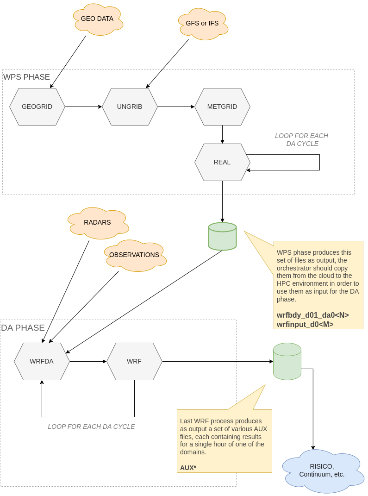

# ensemble-runner

This repository contain GO source code of a series of commands which allows
to run WRF simulations using as input either a GFS forecast or an already existing
dataset produced by the WPS system.

The scripts allows to optionally assimilate radars and weather forecast observations in 2 or 3  
cycle of 3 hours each.

These simulation has following charactertics:

1) They are guided either by IFS or GFS datasets. These datasets should be prepared by one or more WPS processes, either using this workflow or one of our dockers: [wps-da.gfs](https://github.com/meteocima/wps-da.gfs) or [wps-da.ifs](https://github.com/meteocima/wps-da.ifs). You can configure how to guide the forecast using the configuration variable `RunWPS`

2) The simulation assimilates radars and/or weather stations data in 2 or 3 different cycles, according to `AssimilateFirstCycle` with the first one starting 3 or 6 hour before the start of the requested forecast, the subsequent ones at 3 hours each.

4) The simulation consists of 3 nested domain, and assimilation can happens in the inner domain only or in all 3 domains, according to configuration value `AssimilateOnlyInnerDomain`

# Command syntax to start the simulation

Run the command without arguments to start the simulation:

```bash
$ ensrunner
```

# Processes organization within the WPS and DA phases.	

The diagram above represent the main processes running in WPS and DA phases.

	


# Work environment preparation.

The command must run in a work directory containing a `config.yaml` config file. 
This file should be in `yaml`` format, and allows, among other things, to customize 
the path of all others external files and directories needed by the process.

The config files contains following variables:

* __GeogridProc__ 					- number of MPI processes to use when running `geogrid.exe`
* __MetgridProc__ 					- number of MPI processes to use when running `metgrid.exe`
* __WrfProc__ 						- number of MPI processes to use when running `wrf.exe` to run the control forecast or ensemble members
* __WrfStepProc__ 					- number of cores to use for `wrf.exe` in the the intermediate steps of assimilation. 
* __WrfdaProc__ 					- number of MPI processes to use when running `dawrf_var.exe`
* __RealProc__ 						- number of MPI processes to use when running `real.exe`
* __MpiOptions__					- additional arguments to pass in every invocation of `mpirun`
* __ObDataDir__                     - directory where the observation data to assimilate are stored.
* __GeogDataDir__					- path to a directory containing static geographic data used by `geogrid.exe`.
* __CovarMatrixesDir__				- path to a directory containing background errors of covariance matrices.
* __RunWPS__						- specify if boundary and input conditions are produced with WPS or read from `inputs` directory
* __EnsembleMembers__				- number of members in the ensemble (excluding the control forecast)
* __EnsembleParallelism__			- how many ensemble members to run in parallel. 
* __AssimilateObservations__        - whether to assimilate observations or not.
* __AssimilateOnlyInnerDomain__		- when true, assimilation of observation data is done only for the innermost domain
* __AssimilateFirstCycle__			- when true, assimilation of observation data is done also in the first cycle
* __CoresPerNode__					- Number of cores per node in the cluster where the simulation is run.

Additionally, some other informations are read from environment variables. Some of these variables
are already defined by other parts of the system (e.g. by loaded shell modules). Other ones change for every simulations run (e.g. start date or duration of the forecast), so it does not make sense to have them in the config file. Herebelow a list of such variables:

* __START_FORECAST__	-	start of forecast to simulate, in format YYYY-MM-DD-HH. If `START_FORECAST` is omitted, the system find the date or dates to run by reading the file `inputs/arguments.txt`
* __DURATION_HOURS__	-	duration of the forecast. value is ignored when file `inputs/arguments.txt` is used.
* __SLURM_NODELIST__	-	contains hostnames of all available nodes for the simulation.
* __WRF_DIR__			-	path to compiled binaries of the WRF program.
* __WPS_DIR__			-	path to compiled binaries of the WPS program.
* __WRFDA_DIR__			-	path to compiled binaries of the WRF-DA program.
* __ROOTDIR__			-	path to the root directory of the simulation. This is the directory which contains `templates` directory, `workdir` directory, etc. 

# $ROOTDIR directory organization

This is the path of the directory containing `config.yaml` config file. 
Inside this root directory, there are other subdirs whose names are not configurable:

* `$ROOTDIR/workdir/$START_FORECAST` will be used as work directory for the commands while running the simulations. At the end of the simulation, the directory `$ROOTDIR/workdir` will contains a subdirectory for each date of simulation ran, each one containing the complete three of intermediates data and log files used. These directory are named using a YYYY-MM-DD-HH format; 

* `$ROOTDIR/inputs` directory will be created after WPS run, and it will contains results of WPS execution, with a subdirectories for each date ran. This same directory must includes existings dataset if WPS is not configured.

* `$ROOTDIR/results` will contains all output files after completion of the simulation.


# ensrunner

This command takes care of running all the various
WRF processes needed to complete a simulation with assimilation of radars and weather stations data.

# covar-matrices* 

A directory containing pre-built dataset of data needed
by the assimilation process. This data is common between all runs of a certain 
domain (in other words, for all runs that share the same geographical area, 
grid definition etc.)

Moreover, these datasets contains informations that varies according to season.
wrfda-runner takes care of selecting the appropriate file for season of simulation
you're running, and in order to do so, the directory must have following structure:

```
covar-matrices
covar-matrices/summer
covar-matrices/summer/be_d01
covar-matrices/summer/be_d03
covar-matrices/summer/be_d02
covar-matrices/fall
covar-matrices/fall/be_d01
covar-matrices/fall/be_d03
covar-matrices/fall/be_d02
covar-matrices/winter
covar-matrices/winter/be_d01
covar-matrices/winter/be_d03
covar-matrices/winter/be_d02
covar-matrices/spring
covar-matrices/spring/be_d01
covar-matrices/spring/be_d03
covar-matrices/spring/be_d02
```

which is, you have to provide a file ending in _d0N for every N domain in your
configuration, and you have to provide a dataset for each season (or at least,
for the season of the simulation you want to run).

# inputs directory

This directory must contains initial and boundary conditions for the 
simulation, as produced by WPS process. There should be a boundary file
for each of the 3 cycle of assimilation of your outhermost domain, and an initial 
condition for every nested files. In case you want to run simulation for multiple dates, 
in order e.g. to feed warmup data to dowstream simulation chains, you have to provide inputs for each one of the needed dates.

Files have to be organized in following way, to run simulations
for two different dates on a setup with 2 domains:

```
inputs/20201125/wrfbdy_d01_da03
inputs/20201125/wrfbdy_d01_da01
inputs/20201125/wrfbdy_d01_da02
inputs/20201125/wrfinput_d01
inputs/20201125/wrfinput_d02
inputs/20201125/wrfinput_d03
inputs/20201126/wrfbdy_d01_da03
inputs/20201126/wrfbdy_d01_da01
inputs/20201126/wrfbdy_d01_da02
inputs/20201126/wrfinput_d01
inputs/20201126/wrfinput_d02
inputs/20201126/wrfinput_d03
```

# namelists*

this directories must contains namelists for all the various processes
of the simulation you want to run.

The directory must contains following files, named in the same exact way:

    - namelist.step.wrf   - namelist to run a WRF step for a middle cycle of assimilation
    - namelist.run.wrf    - namelist to run last WRF step that produce or requested hours of forecast
    - namelist.d0<N>.wrfda  - namelist to run a WRFDA assimilation cycle in domain N. You must have of this file for each domain, replacing <N> with domain number.
    - parame.in           - ???
    - wrf_var.txt.wrf_01  - wrf_var.txt files for 1 cycle of assimiltion
    - wrf_var.txt.wrf_02  - wrf_var.txt files for 2 cycle of assimiltion
    - wrf_var.txt.wrf_03  - wrf_var.txt files for 3 cycle of assimiltion

This repo contains two different version of namelists directory: namelists.italy which
should be used for Italy domain, and namelists.france for France domain.
The appropriate directory can be choosed by setting the property NamelistsDir in
the .cfg file used.

# observations

This directory contains weather stations and radars datasets you want to 
assimilate during the simulation.

Files must be in WRF assimilation ascii format, and must be named in the following way:

```
observations/ob.radar.2020112609
observations/ob.radar.2020112606
observations/ob.ascii.2020112606
observations/ob.ascii.2020112609
```

The date of the files must indicates the year/month/day/hour of 
each one of the three steps. 

It's possible for WRF to assimilates data of instants slightly different from the nominal 
instant, but the name should nonetheless reflects the nominal instant, not the real one.

In other words, you are allowed to assimilate e.g. radar datas acquired at
2020-11-26 08:53, but the realative file should be named 2020112609.

# schedule-run-*.sh

scripts to schedule the simulation. You'll probably have to change content
of this scripts in order to accomodate your particular server scheduler and configuration.

The main responsibility of this script is to call the `wrfda-runner` command.
`wrfda-runner` then will take cares of calling all needed processes using
MPI commands.

Remember to always call `ulimit -s unlimited` before calling 
`wrfda-runner` scripts, bacause it's needed by WRF.

The script calls `wrfda-runner` without speciyfing any date arguments, this
indicates `wrfda-runner` to read dates and config file path from a file called 
`inputs/arguments.txt` with following format:

```
italy-config.gfs.cfg
2020073100 48
```

These files are produced automatically by [wps-da.gfs](https://github.com/meteocima/wps-da.gfs) and [wps-da.ifs](https://github.com/meteocima/wps-da.ifs) dockers as part of the inputs directory.


